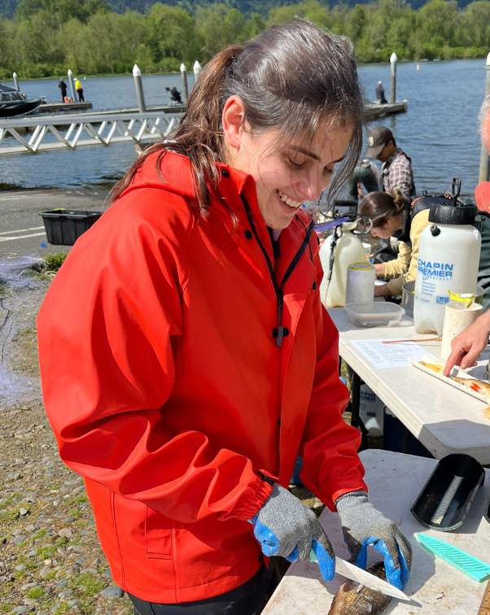

{width=40%}

  

Nicole Doran is a third year Master's student at the University of Washington School of Aquatic and Fishery Sciences. She earned her Bachelor of Science degree in Biology from the Ohio State University, where she studied an endangered eastern massasauga rattlesnake population. After completing an internship with the South Carolina Department of Natural Resources studying blue crab, Nicole decided to pursue fishery sciences at the University of Washington for her graduate degree. Nicole's research interests now are looking at the impacts of changing environmental conditions such as temperature on important fishery species, and how that can in turn effect people that depend on fish for their livelihoods, food, culture, and recreation. Her most recent project is an angler survey of recreational fishers in Lake Sammamish to understand their views on the Lake's fisheries, and their concerns and hopes for the future. You can learn more about it on the "Angler Survey" tab above! 
