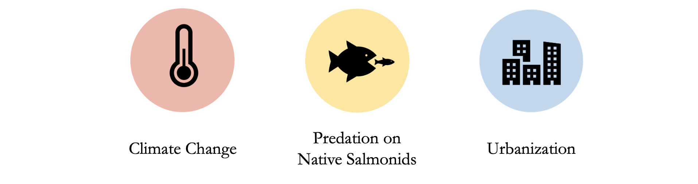

   

Lake Sammamish has gone through a lot of changes over the last few decades, and it's going to keep changing. The changing environment will also cause changes for the local recreational fisheries, including native salmonids. Increasing temperatures due to climate change, competition and predation pressures on native salmonids, and the effects of urbanization such as pollution and degraded habitat are some of the stressors Lake Sammamish's fisheries are facing today.

 

 

To help us understand how recreational fisheries are being impacted, please complete this [survey](https://environmentuw.co1.qualtrics.com/jfe/form/SV_0x53Yn3YBuyYKAm). There are five sections that will ask about your experience fishing in Lake Sammamish, your perceptions of risk to the future of Lake Sammamish due to the stressors above, and your understanding of Kokanee salmon's cultural importance to the Snoqualmie Tribe.

This survey is voluntary and your response will be anonymous. The results will be shared with the Kokanee Work Group to inform their restoration efforts of native salmonids and educational outreach opportunities. Your input is important for protecting the future of Lake Sammamish's fisheries!